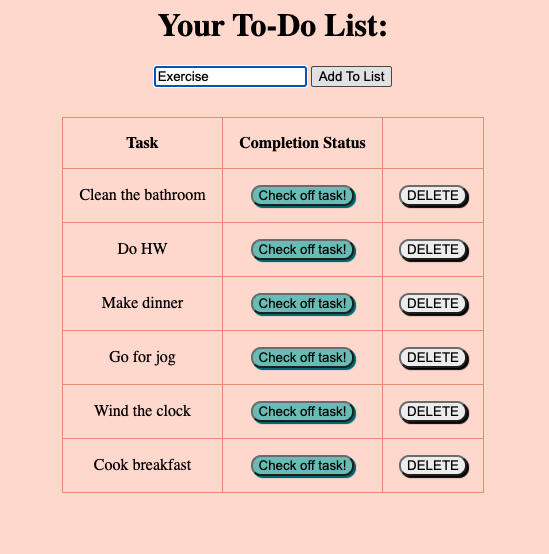
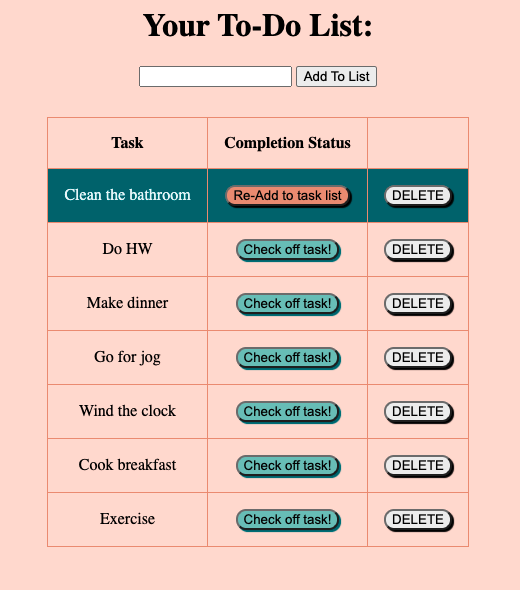

# Task List

## Description

_Duration: Approximately 10 hours_

This application serves as a To-Do list that allows the user to:

- add tasks
- mark tasks as completed (or if they were marked completed by actually need to be completed still/again, they can be returned to the task list)
- delete tasks from the list.

Here is a view of a task list that has 6 items already added to it, and 'Exercise' written in the textbox so that it will be added once the user clicks the "Add To List" button:

Here is the view of the task list with 'Exercise' added to the list, and 'Clean the bathroom' has been marked complete by clicking the 'Check off task!' button next to it. At this point, the completed task is displayed with a green background, and can either be returned to its incomplete status by clicking the 'Re-add to task list' button, or be removed from the task list altogether by clicking the 'DELETE' button next to it:

## Installation

1. Open this repository in your favorite code editor (VS Code was used for creating this app).
1. Install node and express (don't worry, I've already got a nifty .gitignore file to avoid committing and pushing the massive node_modules!) - simply run "npm install" in your terminal.
1. Create a database on your local server (Postico was used during creation).
   1. IMPORTANT: your database needs to be named weekend_to_do_app in order to communicate with the current code.
   1. Copy all of the text in the attached database.sql module and insert it into the SQL Query box of your weekend_to_do_app database.
   1. You can either execute this SQL statement as an entire block, or do them one by one from the top down (important that these are done sequentially in this case).
1. Type npm start into your terminal to start the server.
1. Run localhost:5000/ in your browser.

## Usage

1. Write a task you would like to add to the to-do list into the text box.
1. Click "Add to List". Repeat these first two steps for each new task you would like to add.
1. Once a task has been completed, click the green "Check off task!" button in that task's row on the table. This will turn the entire row green, and the "Check off task!" button will turn into an orange "Re-Add to task list" button.
1. If you would like to unmark a task that has been checked as completed, click the "Re-Add to task list" button that appears next to it after you have clicked "Check off task!".
1. If you would like to completely remove a task from the list (and the database), click the "DELETE" button next to that task.

Happy 'Getting-things-done'!

## Built with:

- HTML
- CSS
- JavaScript
- jQuery (and AJAX/XHR) [JS library]
- Node.js [Back-end JS run-time environment]
- Express [Back-end JS framework for Node.js]
- JSON [allow for transmission of data objects between Client and Server using human-readable text]
- PostgreSQL [relational database management]
- SQL [executing SQL statements to manage database]
- Postico [database app for executing SQL statements and running postgreSQL database tests]

## Acknowledgement

Thanks to [Prime Digital Academy](https://www.primeacademy.io/) who equipped and helped me to make this application a reality.
